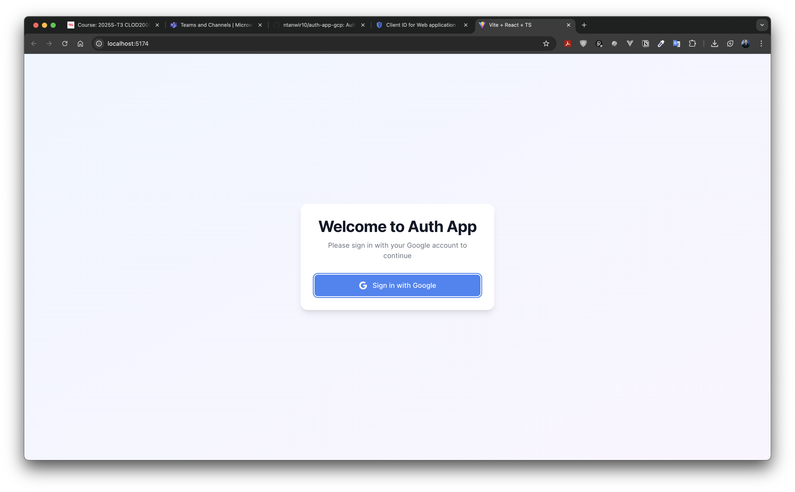
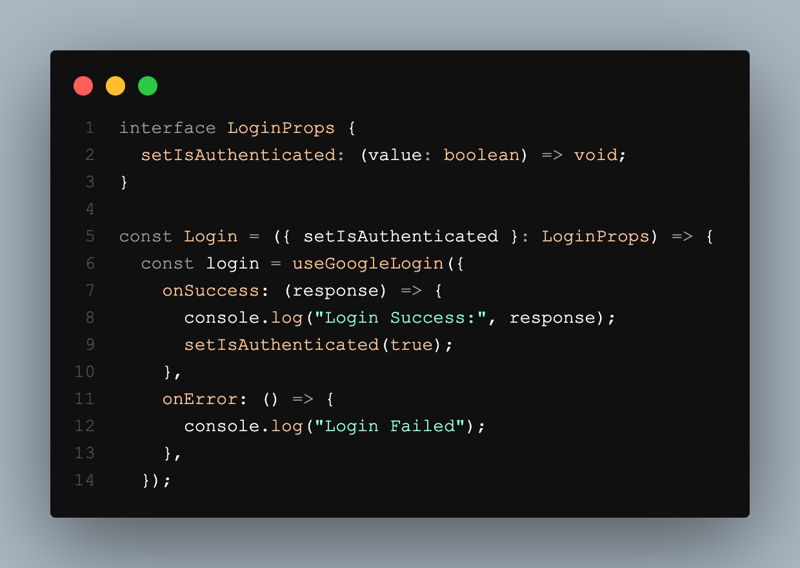
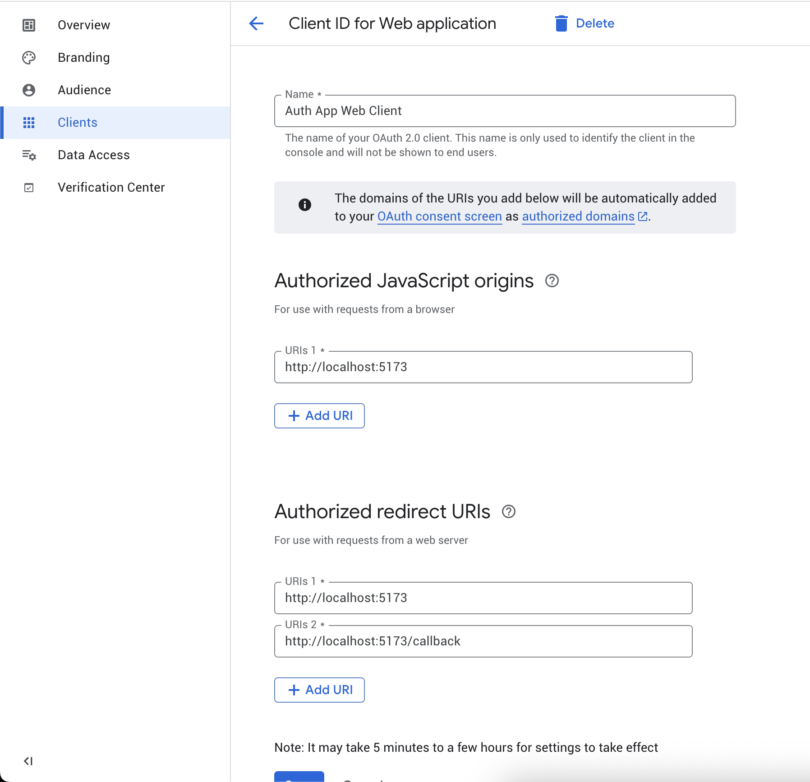
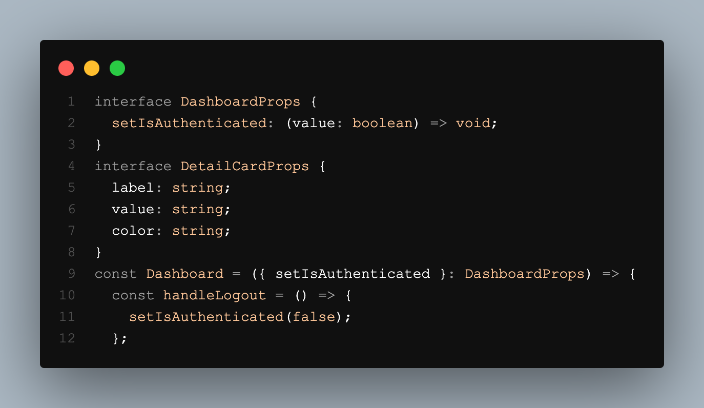

# STUDENT INFORMATION

| Field        | Information                               |
| ------------ | ----------------------------------------- |
| Student Name | Nauman Tanwir                             |
| Student ID   | 500237447                                 |
| Course       | Azure Architect Technologies              |
| Course ID    | CLOD 2005                                 |
| Instructor   | Prof. Sergio Loza                         |
| GitHub Repo  | https://github.com/ntanwir10/auth-app-gcp |

---

# Student Authentication App with Google OAuth

A modern React application that demonstrates secure authentication using Google OAuth 2.0. This application provides a seamless login experience and displays student information in a beautifully designed dashboard.



## Features

- 🔐 Secure Google OAuth 2.0 Authentication
- 🛡️ Protected Routes with React Router
- 🎨 Modern UI with Tailwind CSS
- 📱 Fully Responsive Design
- 🔄 Seamless Login/Logout Flow
- 📊 Student Information Dashboard

## Screenshots

### Authentication Flow
#### Login Page with Google OAuth


#### Google OAuth Implementation


#### Google Cloud Console OAuth Setup


### Dashboard Views
#### Main Dashboard


#### Dashboard with Logout


#### Authentication Provider


## Prerequisites

Before you begin, ensure you have the following installed:
- Node.js (v18.17.0 or higher)
- npm (v9.6.7 or higher)
- A Google Cloud Platform account

## Tech Stack

- ⚛️ React 19.1.0
- 🏗️ TypeScript
- ⚡ Vite
- 🛣️ React Router v7
- 🔑 @react-oauth/google
- 🎨 Tailwind CSS
- 🔍 ESLint
- 📦 Various development tools and utilities

## Setup Instructions

1. **Clone the Repository**
   ```bash
   git clone <repository-url>
   cd auth-app-gcp
   ```

2. **Install Dependencies**
   ```bash
   npm install
   ```

3. **Configure Environment Variables**
   Create a `.env` file in the root directory:
   ```env
   VITE_GOOGLE_CLIENT_ID=your_google_client_id_here
   ```

4. **Google OAuth Setup**
   - Go to the [Google Cloud Console](https://console.cloud.google.com)
   - Create a new project or select an existing one
   - Enable the Google OAuth API
   - Configure the OAuth consent screen
   - Create OAuth 2.0 credentials (Client ID)
   - Add authorized JavaScript origins:
     - `http://localhost:5173` (development)
     - `http://localhost:5174` (alternate development port)
     - Your production URL (if applicable)

## Running the Application

1. **Start Development Server**
   ```bash
   npm run dev
   ```
   The application will start on [http://localhost:5173](http://localhost:5173)

2. **Build for Production**
   ```bash
   npm run build
   ```

3. **Preview Production Build**
   ```bash
   npm run preview
   ```

## Project Structure

```
auth-app-gcp/
├── src/
│   ├── components/
│   │   ├── Login.tsx       # Google OAuth login component
│   │   └── Dashboard.tsx   # Protected dashboard view
│   ├── App.tsx            # Main application component
│   ├── config.ts          # Configuration and environment variables
│   └── main.tsx          # Application entry point
├── public/
├── .env                   # Environment variables
└── package.json          # Project dependencies and scripts
```

## Security Features

- Protected routes using React Router
- Secure Google OAuth 2.0 implementation
- Environment variable configuration for sensitive data
- Type-safe implementation with TypeScript
